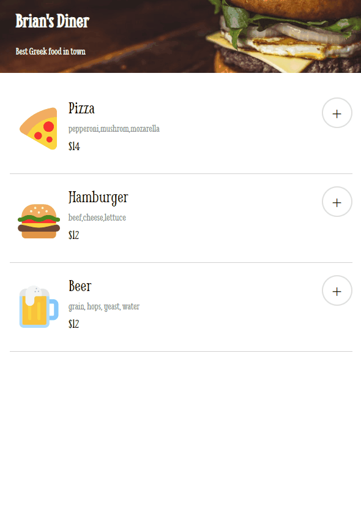

# Restaurant Ordering App



**Link to project:** https://restaurant-ordering-app-brianbud.netlify.app/

## About Project

- This is a solo project made without following any tutorial. Only followed a Figma design file.

- This project is a simple online food ordering system. The menu options are imported from a "data.js" file and displayed on the page. The menu options include an emoji, item name, ingredients, price, and id.

- The user can add items to their order by clicking the "+" button, which adds the item to the "orderArray" and calculates the total price in "allPrices". The user can also remove items from their order.

- The user can complete their order by clicking the "Complete Order" button, which brings up a credit card form that, when submitted, shows a delivery status.

- If the user submits their order, the order is reset, and the user can start a new order.

**Tech used:** HTML, CSS, JAVASCRIPT

Quick start:

```
$ npm install
$ npm start
```
