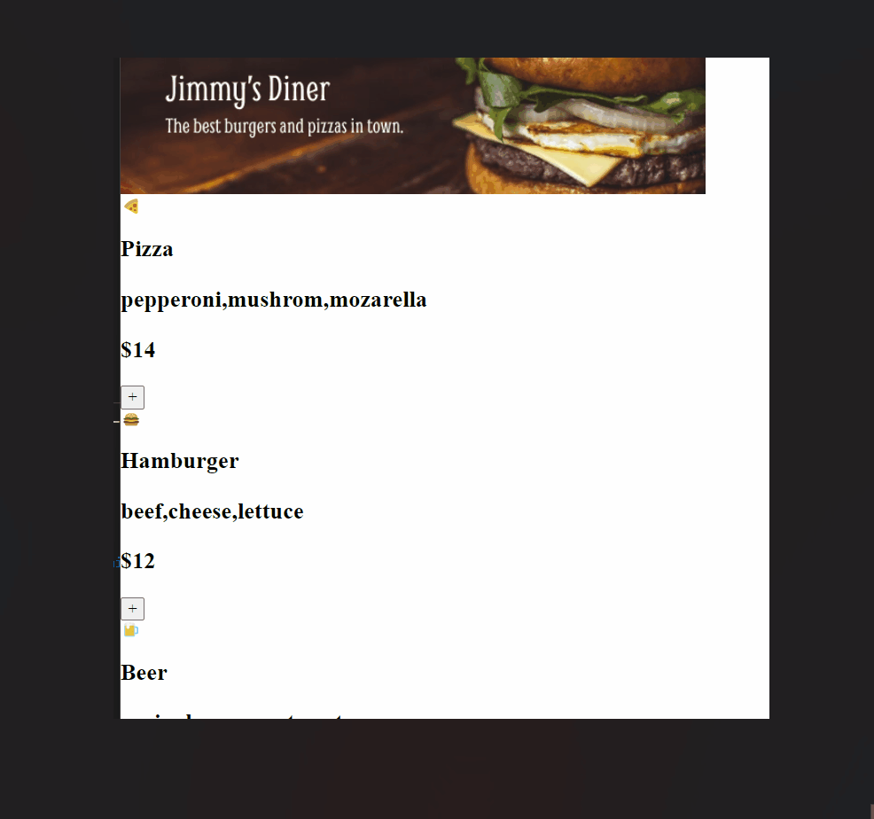

# Restaurant Ordering App

A simple online food ordering system that allows users to view menu options, add items to their order, remove items, and complete their order with a credit card form that displays a delivery status upon submission.



**Link to project:** https://restaurant-ordering-app-brianbud.netlify.app/

## About Project

- This is a solo project made without following any tutorial. Only followed a Figma design file.

- This project is a simple online food ordering system. The menu options are imported from a "data.js" file and displayed on the page. The menu options include an emoji, item name, ingredients, price, and id.

- The user can add items to their order by clicking the "+" button, which adds the item to the "orderArray" and calculates the total price in "allPrices". The user can also remove items from their order.

- The user can complete their order by clicking the "Complete Order" button, which brings up a credit card form that, when submitted, shows a delivery status.

- If the user submits their order, the order is reset, and the user can start a new order.

**Tech used:** HTML, CSS, JAVASCRIPT

## Challenges

While working on a project, I encountered several challenges. The main issue I faced was updating the total price after removing an item from the order. There were two arrays, one for the order items and another for the prices. When a meal was added, the price was pushed into the price array. To remove an item, I used a combination of array methods to accomplish the task.

The first step was to identify the correct element in the price array to remove. I used the findIndex() method to find the index of the element in the array. Next, I used splice(itemIndex, 1) to remove the element at that index from the price array.

To keep only the prices I needed, I used filter() method to filter the array. Lastly, I used the reduce() method to find the sum of the remaining prices in the array, which gave me the updated total price.

It was interesting to use all these array methods in solving the challenge.

Quick start:

```
$ npm install
$ npm start
```
